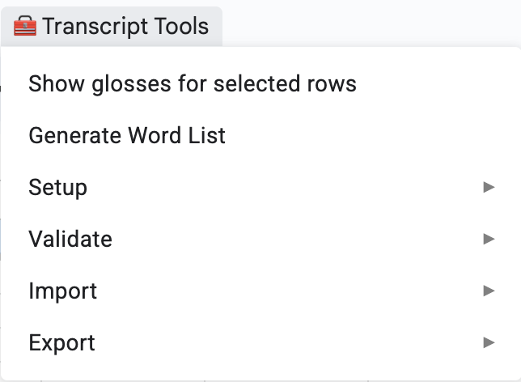

# Transcription Starter Kit
Tools for teaching linguistic transcription and growing small documentation projects.

## Goals
* Provide a portable library for editing, validating, managing, and migrating linguistic transcription data.
* Quickly grow a new language documentation project.
* Provide resources for migrating data to widely adopted language documentation tools.

## Components
`Transcript Starter Kit` has two main components:
1. A standalone set of [TypeScript classes](./src/). See [example README](./examples/README.md) for usage.
2. A [Google Apps Script integration](./src/gsheets/) to provide this functionality in a Google Sheets Add-On.
&nbsp;&nbsp;

## Getting Started
### Google Workspace Marketplace Add-Ons
In progress, not yet available--pending approval by Google.

### Deploy using clasp
See [developer docs](./DEVELOPER.md) for instructions on deploying the code to your own Google account using [Google Clasp](https://github.com/google/clasp).